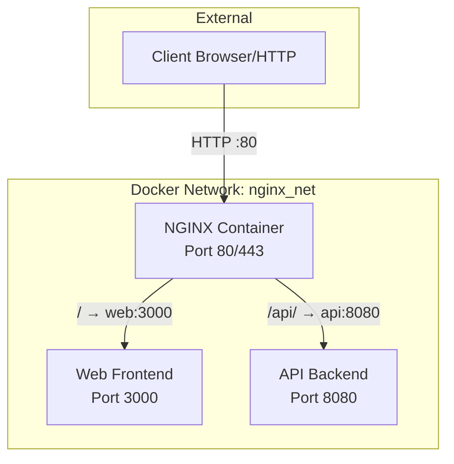

# NGINX Docker Reverse Proxy

A production-ready, minimal reverse proxy image based on NGINX. Supports path-based routing, observability, container health checks, and easy configuration via environment variables.

---

## Quick Start

Clone the repository and run:

```bash
docker compose up -d
```

_NGINX will be available at http://localhost:80 by default._

---

## Environment Configuration

Create a `.env` file or export desired values before running. All configurable variables are shown below (see also `.env.example`).

| Variable             | Default    | Description                      |
|----------------------|------------|----------------------------------|
| NGINX_HTTP_PORT      | 80         | Port for HTTP traffic            |
| UPSTREAM_WEB_HOST    | web        | Host for frontend container      |
| UPSTREAM_WEB_PORT    | 3000       | Port for frontend                |
| UPSTREAM_API_HOST    | api        | Host for API backend             |
| UPSTREAM_API_PORT    | 8080       | Port for API backend             |
| MAX_BODY_SIZE        | 50m        | Max upload size (e.g. file)      |
| GZIP_ENABLED         | on         | Enable Gzip compression (on/off) |

See `.env.example` for copy-paste starting values.

---

## Architecture



- NGINX acts as a reverse proxy and router. It can serve as an entrypoint for multiple services and enforce security and observability.
- Static file serving is supported for frontend assets (if enabled).

---

## Healthchecks

- NGINX exposes `/healthz`, returns 200 OK if NGINX is ready.
- The container healthcheck runs `curl --fail --silent http://localhost/healthz`.

---

## Logging

- Access logs are output to stdout
- Error logs go to stderr
- Both are Docker compatible: use `docker logs <container>`

---

## Customization

- All NGINX routing and behaviours are versioned as templates/config.
- Custom error page at `html/502.html` (used on backend 502/504 errors).
- To enable TLS, mount your certs to `/etc/nginx/certs/` and update the NGINX config as shown in `templates/nginx.conf.template` (see commented block for listen 443).

---

## Testing

| Requirement           | Test Command                                   |
|----------------------|------------------------------------------------|
| Container starts     | `docker compose up -d && docker ps`            |
| Reverse proxy        | `curl http://localhost/api/health`              |
| Path routing         | `curl http://localhost/` and `/api/`           |
| Headers forwarding   | Check `X-Forwarded-For` in backend logs         |
| Payload limit        | Upload >50MB file to test for 413 error         |
| Health endpoint      | `curl http://localhost/healthz`                 |
| Logs in Docker       | `docker logs beacon-nginx`                      |

---

## TLS Example (Optional)

1. Mount valid cert files as a volume:
    - `/etc/nginx/certs/fullchain.pem`
    - `/etc/nginx/certs/privkey.pem`
2. Uncomment the SSL section in `nginx.conf.template`.
   - Ensure `listen 443 ssl http2;` and `ssl_certificate`, `ssl_certificate_key` are active.

---

## Troubleshooting

- **Container won’t start?** Check `docker logs beacon-nginx` for error output.
- **502/504 Errors?** Ensure upstream apps are running and networked as expected.
- **Env vars not applied?** Rebuild with `docker compose up --build` if you’ve changed config.

---

## Attribution
Built based on requirements authored by Nicolas Lallier, 2026.

---
