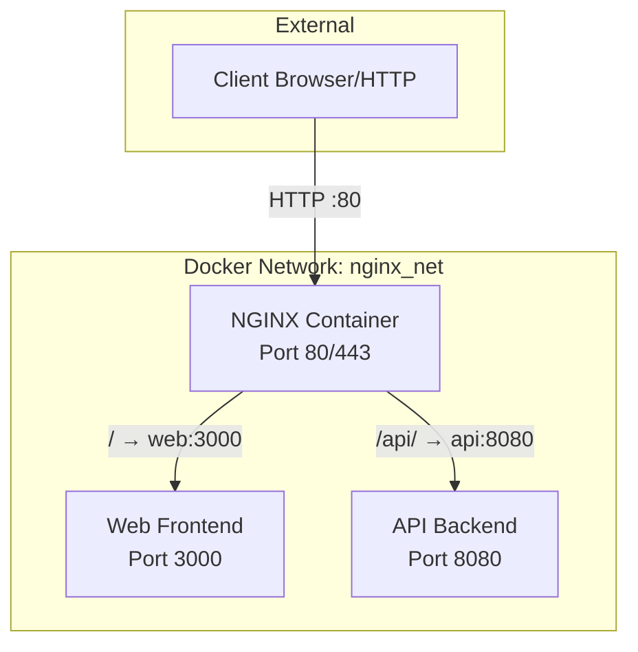
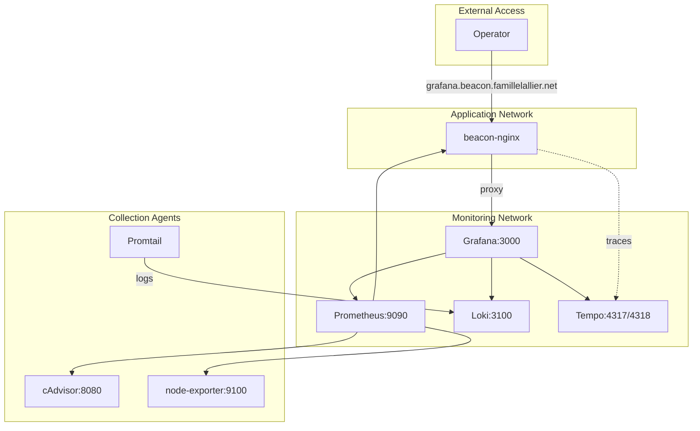

# NGINX Docker Reverse Proxy

A production-ready, minimal reverse proxy image based on NGINX. Supports path-based routing, observability, container health checks, and easy configuration via environment variables.

---

## Quick Start

### NGINX Only

Clone the repository and run:

```bash
make up
# or
docker compose up -d
```

_NGINX will be available at http://localhost:80 by default._

### With Monitoring Stack

To start NGINX with the full observability stack (Grafana, Prometheus, Loki, Tempo):

```bash
# Set Grafana admin password first
echo "GF_SECURITY_ADMIN_PASSWORD=your-secure-password" >> .env

# Start everything
make up-monitoring
# or
docker compose --profile monitoring up -d
```

_Grafana will be available at http://grafana.beacon.famillelallier.net (default admin/admin, change via env var)._

To start only the monitoring stack (without NGINX):

```bash
make up-monitoring-only
```

---

## Environment Configuration

Create a `.env` file or export desired values before running. All configurable variables are shown below.

### NGINX Variables

| Variable             | Default    | Description                      |
|----------------------|------------|----------------------------------|
| NGINX_HTTP_PORT      | 80         | Port for HTTP traffic            |
| UPSTREAM_WEB_HOST    | web        | Host for frontend container      |
| UPSTREAM_WEB_PORT    | 3000       | Port for frontend                |
| UPSTREAM_API_HOST    | api        | Host for API backend             |
| UPSTREAM_API_PORT    | 8080       | Port for API backend             |
| UPSTREAM_GRAFANA_HOST| grafana    | Host for Grafana container       |
| UPSTREAM_GRAFANA_PORT| 3000       | Port for Grafana                 |
| UPSTREAM_MINIO_CONSOLE_HOST| minio1     | Host for MinIO Console           |
| UPSTREAM_MINIO_CONSOLE_PORT| 9001       | Port for MinIO Console            |
| UPSTREAM_MINIO_S3_HOST| minio1     | Host for MinIO S3 API             |
| UPSTREAM_MINIO_S3_PORT| 9000       | Port for MinIO S3 API             |
| MAX_BODY_SIZE        | 50m        | Max upload size (e.g. file)      |
| GZIP_ENABLED         | on         | Enable Gzip compression (on/off) |

### Monitoring Stack Variables

| Variable                      | Default    | Description                              |
|-------------------------------|------------|------------------------------------------|
| GF_SECURITY_ADMIN_PASSWORD    | (required) | Grafana admin password (set in `.env`)   |

### MinIO Variables

| Variable                      | Default    | Description                              |
|-------------------------------|------------|------------------------------------------|
| MINIO_ROOT_USER               | minioadmin | MinIO root user (admin access)           |
| MINIO_ROOT_PASSWORD           | minioadmin | MinIO root password (change in prod!)    |

**Important**: Change `MINIO_ROOT_USER` and `MINIO_ROOT_PASSWORD` in your `.env` file before starting MinIO in production. Never commit passwords to version control.

**Note**: Grafana is accessed via NGINX proxy at `grafana.beacon.famillelallier.net`. The direct port mapping has been removed for security.

**Important**: Set `GF_SECURITY_ADMIN_PASSWORD` in your `.env` file before starting the monitoring stack. Never commit passwords to version control.

### Technitium DNS Variables

| Variable                      | Default    | Description                              |
|-------------------------------|------------|------------------------------------------|
| TECHNITIUM_DNS_PORT           | 8053       | Host port for DNS service (UDP/TCP)      |
| TECHNITIUM_WEB_PORT           | 5380       | Host port for Technitium web GUI         |

**Note**: The default DNS port is `8053` to avoid conflicts with system DNS (port 53 requires root privileges) and macOS mDNSResponder (port 5353). To use port 53, you'll need to run Docker with appropriate privileges or configure port forwarding.

---

## Technitium DNS Server (Ranger DNS GUI)

The Beacon stack now uses Technitium DNS Server for DNS management. It provides a web GUI and persistent configuration stored in a Docker volume.

### Starting the DNS Service

The DNS service starts automatically with the main stack:

```bash
make up
# or
docker compose up -d
```

To start only the DNS service:

```bash
docker compose up -d technitium-dns
```

### Web GUI

- Access: `http://localhost:${TECHNITIUM_WEB_PORT:-5380}`
- On first launch, the UI will prompt you to set up admin access and basic settings.

### Configuring macOS to Use Technitium DNS

macOS system DNS settings only accept IP addresses (not IP:port). Since Technitium DNS runs on port 8053 by default, use one of the following options:

**Option A: Port Forwarding (Recommended)**

Forward port 53 to 8053 with `socat`:

```bash
# Install socat if needed: brew install socat
sudo socat UDP4-LISTEN:53,fork UDP4:127.0.0.1:8053 &
sudo socat TCP4-LISTEN:53,fork TCP4:127.0.0.1:8053 &
```

Then configure macOS DNS to use `127.0.0.1`:

```bash
sudo networksetup -setdnsservers Wi-Fi 127.0.0.1
```

**Option B: Use Port 53 Directly**

Set `TECHNITIUM_DNS_PORT=53` in `.env` and restart. Note: This may require Docker to run with elevated privileges.

### Testing DNS Resolution

```bash
# Query the DNS server directly (on custom port)
dig @127.0.0.1 -p 8053 google.com

# Query via system DNS (if port forwarding is set up)
dig @127.0.0.1 google.com

# Check DNS server logs
docker logs beacon-technitium-dns
```

### Prometheus DNS Probe Metrics

DNS availability and latency are tracked via Blackbox Exporter. The probe targets the Technitium DNS service and exposes metrics in Prometheus.

### Troubleshooting

- **DNS not resolving?** Ensure the `technitium-dns` container is running: `docker ps | grep technitium`
- **Port conflicts?** Change `TECHNITIUM_DNS_PORT` in `.env` if port 8053 is already in use
- **macOS not using DNS?** Verify DNS settings: `scutil --dns | grep nameserver`
- **Port 5353 already in use?** This is normal on macOS (used by mDNSResponder). The default port is 8053
- **Permission denied?** Port 53 requires root. Use port 8053 (default) with port forwarding, or run Docker with appropriate privileges

---

## Architecture

### NGINX Reverse Proxy



- NGINX acts as a reverse proxy and router. It can serve as an entrypoint for multiple services and enforce security and observability.
- Static file serving is supported for frontend assets (if enabled).

### Monitoring Stack (Optional)



The monitoring stack provides:
- **Grafana**: Unified dashboards for metrics, logs, and traces
- **Prometheus**: Metrics collection and alerting
- **Loki**: Log aggregation and querying
- **Tempo**: Distributed tracing storage
- **Promtail**: Log collection from Docker containers
- **cAdvisor**: Container metrics
- **node-exporter**: Host-level metrics

---

## Healthchecks

- NGINX exposes `/healthz`, returns 200 OK if NGINX is ready.
- The container healthcheck runs `curl --fail --silent http://localhost/healthz`.

---

## Logging

- Access logs are output to stdout
- Error logs go to stderr
- Both are Docker compatible: use `docker logs <container>`

---

## Customization

- All NGINX routing and behaviours are versioned as templates/config.
- Custom error page at `html/502.html` (used on backend 502/504 errors).
- To enable TLS, mount your certs to `/etc/nginx/certs/` and update the NGINX config as shown in `templates/nginx.conf.template` (see commented block for listen 443).

---

## Testing

| Requirement           | Test Command                                   |
|----------------------|------------------------------------------------|
| Container starts     | `docker compose up -d && docker ps`            |
| Reverse proxy        | `curl http://localhost/api/health`              |
| Path routing         | `curl http://localhost/` and `/api/`           |
| Headers forwarding   | Check `X-Forwarded-For` in backend logs         |
| Payload limit        | Upload >50MB file to test for 413 error         |
| Health endpoint      | `curl http://localhost/healthz`                 |
| Logs in Docker       | `docker logs beacon-nginx`                      |

---

## TLS Example (Optional)

1. Mount valid cert files as a volume:
    - `/etc/nginx/certs/fullchain.pem`
    - `/etc/nginx/certs/privkey.pem`
2. Uncomment the SSL section in `nginx.conf.template`.
   - Ensure `listen 443 ssl http2;` and `ssl_certificate`, `ssl_certificate_key` are active.

---

## Monitoring Stack Usage

### Starting/Stopping

```bash
# Start NGINX + monitoring
make up-monitoring

# Start only monitoring stack
make up-monitoring-only

# Stop monitoring services
make down-monitoring-only

# View monitoring logs
make monitoring-logs

# Check monitoring service health
make monitoring-status
```

### Accessing Grafana

1. Open http://grafana.beacon.famillelallier.net
2. Login with:
   - Username: `admin`
   - Password: Value from `GF_SECURITY_ADMIN_PASSWORD` env var
3. Datasources (Prometheus, Loki, Tempo) are auto-provisioned
4. Baseline dashboards are available:
   - Services Overview
   - Infrastructure Overview
   - Logs Overview
   - Stack Health

### Prometheus Targets

Prometheus scrapes:
- `prometheus` (self-monitoring)
- `node-exporter` (host metrics)
- `cadvisor` (container metrics)
- `loki` (Loki metrics)
- `tempo` (Tempo metrics)

Access Prometheus UI at http://localhost:9090 (internal network only).

### Log Collection

Promtail automatically collects logs from:
- Docker containers (via Docker socket)
- System logs (`/var/log/*.log`)

Logs are labeled with:
- `container`: Container name
- `compose_service`: Docker Compose service name
- `image`: Container image

### Alert Rules

Baseline alerts are configured in `monitoring/prometheus/rules/alerts.yml`:
- TargetDown: Scrape target unreachable
- HighErrorRate: HTTP 5xx > 5%
- HighLatency: p95 latency > 500ms
- HighCPU: Container CPU > 80%
- HighMemory: Container memory > 80%
- DiskSpaceLow: Disk usage > 85%

### Data Retention

- **Prometheus**: Configurable (default: 7-15 days)
- **Loki**: 7 days (configurable in `monitoring/loki/loki-config.yml`)
- **Tempo**: 7 days (configurable in `monitoring/tempo/tempo-config.yml`)

### Persistence

All monitoring data persists in Docker volumes:
- `beacon_grafana-data`: Grafana state and dashboards
- `beacon_prometheus-data`: Metrics TSDB
- `beacon_loki-data`: Log chunks
- `beacon_tempo-data`: Trace data

---

## Troubleshooting

- **Container won’t start?** Check `docker logs beacon-nginx` for error output.
- **502/504 Errors?** Ensure upstream apps are running and networked as expected.
- **Env vars not applied?** Rebuild with `docker compose up --build` if you’ve changed config.

---

## Attribution
Built based on requirements authored by Nicolas Lallier, 2026.

---

### Monitoring Stack Issues

- **Grafana password not working?** Grafana stores the admin password in its database. If you changed `GF_SECURITY_ADMIN_PASSWORD` in `.env` after Grafana was first started, reset Grafana: `make reset-grafana` then `make up-monitoring`. This deletes all Grafana data and recreates it with the new password.
- **Grafana won't start?** Ensure `GF_SECURITY_ADMIN_PASSWORD` is set in `.env`.
- **Environment variables not applied?** Restart containers after changing `.env`: `make down-monitoring && make up-monitoring`. Check variables: `make env-check`.
- **Prometheus targets down?** Check network connectivity: `docker network inspect beacon_monitoring_net`.
- **No logs in Loki?** Verify Promtail is running: `docker logs beacon-promtail`.
- **Loki permission errors (`chown: Operation not permitted`)?** The Loki volume may have incorrect permissions. Recreate the volume:
  ```bash
  docker compose --profile monitoring stop loki
  docker volume rm beacon_loki-data
  docker compose --profile monitoring up -d loki
  ```
  The entrypoint script will create directories with correct permissions on the fresh volume.
- **Config parsing errors?** Check service logs: `make monitoring-logs`.
- **Dashboards not loading?** Verify datasources are provisioned: Grafana → Configuration → Data Sources.
